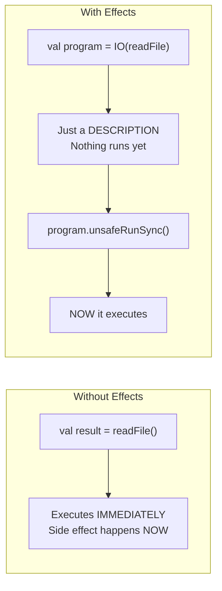
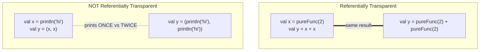

# Why Effects? ``

This module is the conceptual core of this roadmap. Everything before was syntax. Everything after uses what you learn here. Read carefully.

## The Problem: Side Effects Break Reasoning

A pure function always returns the same output for the same input. You can reason about it, test it, compose it, cache it.

A side effect breaks this contract:

```scala
// Pure — predictable, testable
def add(a: Int, b: Int): Int = a + b

// Side effects — unpredictable, untestable in isolation
def getUser(id: Int): User =
  val connection = database.getConnection()        // side effect: I/O
  val result = connection.query(s"SELECT ...")     // side effect: I/O
  if result.isEmpty then throw new Exception("!!") // side effect: exception
  User(result(0), result(1))                       // depends on external state
```

What goes wrong with side effects:

1. **Exceptions** — Thrown anywhere, caught anywhere (or not caught). Not tracked by types. The compiler doesn't know `getUser` can fail.
2. **Null** — Returned silently. The compiler doesn't tell you to check for null.
3. **Callback hell** — Nested async callbacks. Unreadable. Uncomposable.
4. **Hidden dependencies** — `getUser` depends on a global `database`. Can't test without a real database.
5. **Ordering** — Side effects happen in unpredictable order in concurrent code.

In a backend service, every handler does I/O: read HTTP request, query database, call external service, write response. Side effects are unavoidable. The question is: how do you manage them?

## The Solution: Encode Effects in Types

Instead of hiding effects, encode them in the type system:

```scala
// The return type says: "a computation that may fail with AppError and produces a User"
def getUser(id: Int): IO[AppError, User]
```

`IO[AppError, User]` is a **value that describes a computation**. It does not run. It is a blueprint. A recipe. The type tells you:



- This computation produces a `User`
- It may fail with an `AppError`
- It performs side effects (captured in `IO`)

You compose these blueprints:

```scala
def handleRequest(req: Request): IO[AppError, Response] =
  for
    userId <- parseUserId(req)     // IO[AppError, Int]
    user   <- getUser(userId)      // IO[AppError, User]
    _      <- logAccess(user)      // IO[AppError, Unit]
  yield Response(user)
```

Each step is a value. The for-comprehension combines them into one value. Nothing runs yet. At the edge of your application (the `main` method), you run the whole thing.

## Referential Transparency

A function is referentially transparent if you can replace its call with its result without changing program behavior.



```scala
// Referentially transparent
val x = add(1, 2)  // x = 3
val y = add(1, 2)  // y = 3
// x + y == 6, same as add(1,2) + add(1,2) == 6

// NOT referentially transparent
val x = readLine()   // reads "hello"
val y = readLine()   // reads "world"
// x + y != readLine() + readLine() — each call returns different results
```

When effects are encoded in `IO`, referential transparency is restored:

```scala
val readUser: IO[User] = getUser(1)
val result = for
  u1 <- readUser
  u2 <- readUser
yield (u1, u2)
// readUser is a value. You can reason about it. It describes the same computation every time.
```

## Why This Matters

1. **Testability** — `IO[User]` is a value. In tests, you can swap it with a pure value. No mocking framework needed.
2. **Composition** — IO values compose with for-comprehensions. Complex workflows from simple pieces.
3. **Error safety** — The type says what errors are possible. The compiler ensures you handle them.
4. **Concurrency** — IO values are safe to run concurrently. No shared mutable state.
5. **Reasoning** — You can understand a function by reading its type signature.

## The Mental Model Shift

Stop thinking: "this function DOES something"
Start thinking: "this function DESCRIBES something"

```scala
// Describes: "get a user, then format their name"
val program: IO[User] = for
  user <- getUser(1)
yield user

// Running is separate from describing
program.unsafeRunSync()  // Now it actually executes
```

Description and execution are separate. You build a description of your entire program, then hand it to a runtime that executes it.

This is the paradigm shift. Master this, and the rest of Scala backend falls into place.

Next: [Cats Effect](02-cats-effect.md)
