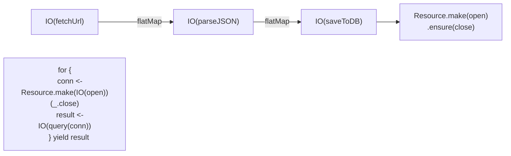

# Cats Effect ``

Cats Effect is the most widely used effect system in the Scala ecosystem. It provides `IO[A]` — a type that describes a side-effecting computation producing a value of type `A`.

## Setup

Add to `build.sbt`:

```scala
libraryDependencies += "org.typelevel" %% "cats-effect" % "3.5.4"
```

## IO — The Core Type

```scala
import cats.effect.IO

// Create an IO from a pure value
val pure: IO[Int] = IO.pure(42)

// Create an IO from a side-effecting action (delay evaluation)
val effect: IO[String] = IO(scala.io.StdIn.readLine())

// Create an IO that prints (convenience)
val print: IO[Unit] = IO.println("Hello")
```

`IO[A]` is a value describing a computation. It does nothing until explicitly run.

## map and flatMap — Transforming IO Values

```scala
val number: IO[Int] = IO.pure(42)

val doubled: IO[Int] = number.map(_ * 2)

val parsed: IO[Int] = IO("42").map(_.toInt)
```

`flatMap` sequences computations — the second depends on the result of the first:

```scala
val program: IO[Unit] =
  IO.println("What is your name?").flatMap { _ =>
    IO(scala.io.StdIn.readLine()).flatMap { name =>
      IO.println(s"Hello, $name")
    }
  }
```

## for-Comprehensions Over IO

for-comprehensions are syntactic sugar for `flatMap`/`map`. They make sequential IO readable:



```scala
val program: IO[Unit] = for
  _    <- IO.println("What is your name?")
  name <- IO(scala.io.StdIn.readLine())
  _    <- IO.println(s"Hello, $name")
yield ()
```

This is the same `for` syntax from collections. It works because `IO` has `flatMap` and `map`. The same abstraction that iterates lists also sequences effects. This uniformity is powerful.

## Resource Management

Real programs acquire resources (database connections, file handles) that must be released. `Resource` ensures cleanup even if errors occur:

```scala
import cats.effect.{IO, Resource}
import java.io.{BufferedReader, FileReader}

def openFile(path: String): Resource[IO, BufferedReader] =
  Resource.make(IO(new BufferedReader(new FileReader(path)))) { reader =>
    IO(reader.close()).handleErrorWith(_ => IO.unit)
  }

val program: IO[String] = for
  line <- openFile("data.txt").use { reader =>
    IO(reader.readLine())
  }
yield line
```

Step by step:
1. `Resource.make(acquire)(release)` — describes acquiring a resource and how to release it
2. `.use { resource => ... }` — runs a computation with the resource, then releases it
3. Release happens even if the computation fails

## Complete Example: Read, Parse, Write

```scala
import cats.effect.{IO, Resource, IOApp}
import java.io.{BufferedWriter, FileWriter, BufferedReader, FileReader}

object Main extends IOApp.Simple:

  def readFile(path: String): IO[String] =
    Resource.fromAutoCloseable(IO(new BufferedReader(FileReader(path)))).use { reader =>
      IO(reader.readLine())
    }

  def parseNumber(s: String): IO[Int] =
    IO(s.toInt).handleErrorWith(_ =>
      IO.raiseError(new Exception(s"'$s' is not a number")))

  def writeFile(path: String, content: String): IO[Unit] =
    Resource.fromAutoCloseable(IO(new BufferedWriter(FileWriter(path)))).use { writer =>
      IO(writer.write(content))
    }

  val run: IO[Unit] = for
    raw      <- readFile("input.txt")
    number   <- parseNumber(raw)
    result    = number * 2
    _        <- writeFile("output.txt", s"Result: $result")
    _        <- IO.println(s"Processed: $raw -> $result")
  yield ()
```

Step by step:
1. `readFile` — acquire file reader, read one line, release reader
2. `parseNumber` — parse string to int, produce typed error if invalid
3. `writeFile` — acquire file writer, write result, release writer
4. `IOApp.Simple` — provides the `main` method. Override `run` with your IO program.

Every step is an `IO` value. The for-comprehension builds a single `IO[Unit]` that describes the entire workflow. The `IOApp` runtime executes it.

## IOApp

`IOApp` replaces `def main(args: Array[String]): Unit`. It provides the IO runtime:

```scala
object MyApp extends IOApp.Simple:
  val run: IO[Unit] = IO.println("Running!")

// Or with args:
object MyApp extends IOApp:
  def run(args: List[String]): IO[ExitCode] =
    IO.println(s"Args: $args").as(ExitCode.Success)
```

Next: [ZIO Basics](03-zio-basics.md)
