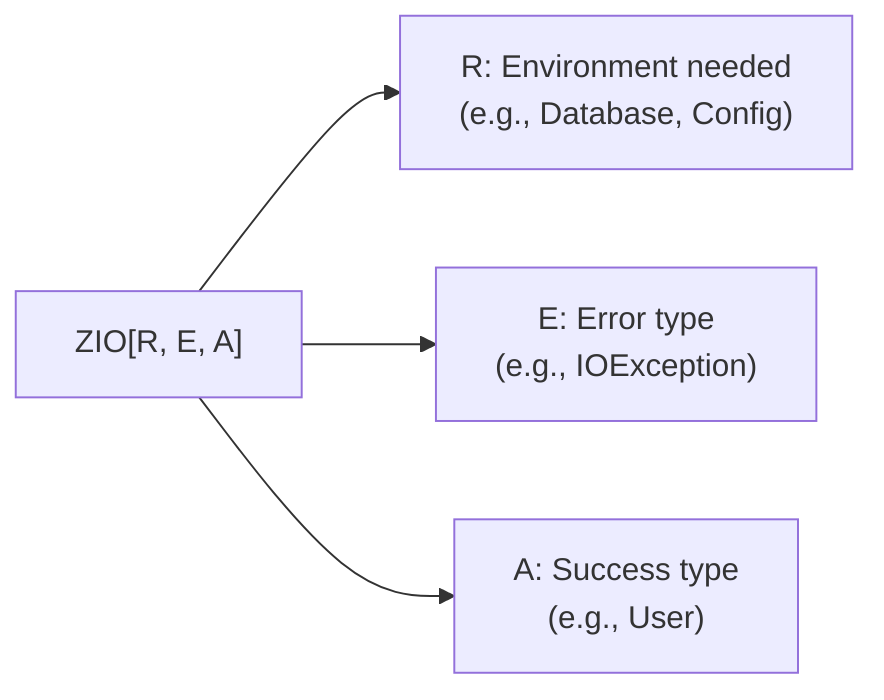
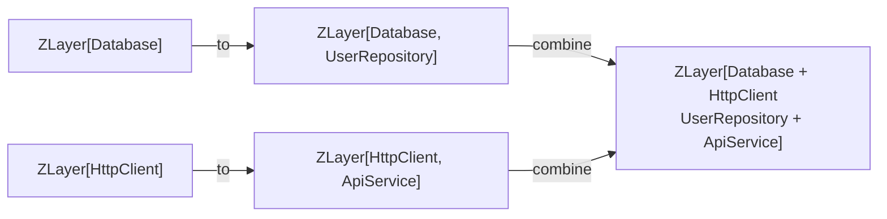

# ZIO Basics ``

ZIO is an alternative effect system to Cats Effect. It has a different type signature that bakes in environment and error channels, providing a more integrated experience out of the box.

## ZIO Type Signature

```scala
ZIO[R, E, A]
```

- **R** — Environment type. What dependencies this computation requires. `Any` means no requirements.
- **E** — Error type. How this computation can fail. `Nothing` means cannot fail.
- **A** — Success type. What this computation produces.

Compare with Cats Effect's `IO[A]` (error is always `Throwable`, no environment):

```scala
// Cats Effect
def getUser(id: Int): IO[User]  // errors are Throwable, no environment

// ZIO
def getUser(id: Int): ZIO[Database, UserError, User]
// requires Database in environment, fails with UserError, succeeds with User
```

ZIO's type is more informative. You can read the signature and know: what it needs, how it fails, what it produces.



## Basic Operations

```scala
import zio.*

// Succeed with a value
val pure: Task[Int] = ZIO.succeed(42)
// Task[A] = ZIO[Any, Throwable, A] — no environment, Throwable errors

// Fail with an error
val fail: IO[String, Int] = ZIO.fail("something went wrong")
// IO[E, A] = ZIO[Any, E, A] — no environment, typed error

// Side-effecting
val effect: Task[String] = ZIO.attempt(scala.io.StdIn.readLine())

// For-comprehensions work the same
val program = for
  _    <- Console.printLine("What is your name?")
  name <- Console.readLine
  _    <- Console.printLine(s"Hello, $name")
yield ()
```

## Environment (Dependency Injection)

ZIO's environment channel is its key differentiator. Dependencies are declared in the type and provided at the edge:

```scala
// Define a service interface
trait UserRepository:
  def find(id: Int): Task[User]
  def save(user: User): Task[Unit]

// Use it — type says "I need UserRepository"
def getUser(id: Int): ZIO[UserRepository, Throwable, User] =
  ZIO.serviceWithZIO(_.find(id))

// Provide the implementation at the edge
val liveRepository: UserRepository = new UserRepository:
  def find(id: Int): Task[User] = ???  // real database
  def save(user: User): Task[Unit] = ???

val program = getUser(1).provide(ZLayer.succeed(liveRepository))
```

In Cats Effect, dependency injection is done through constructor parameters or Kleisli. ZIO builds it into the type. The compiler ensures every dependency is provided before the program runs.

## ZLayer — Composable Dependencies

`ZLayer` describes how to build a service. Layers compose:

```scala
trait Database:
  def query(sql: String): Task[List[Row]]

trait UserRepository:
  def find(id: Int): Task[User]

// Layer: how to build a UserRepository from a Database
val userRepoLayer: ZLayer[Database, Nothing, UserRepository] =
  ZLayer.fromFunction((db: Database) => new UserRepository:
    def find(id: Int): Task[User] =
      db.query(s"SELECT * FROM users WHERE id = $id").map(rows => ???)
  )

// Layer: how to build a Database
val databaseLayer: ZLayer[Any, Throwable, Database] =
  ZLayer.fromFunction(() => ???)  // connection pool, config, etc.

// Compose: Database => UserRepository
val fullLayer: ZLayer[Any, Throwable, UserRepository] =
  databaseLayer >>> userRepoLayer

// Run with all layers provided
val app = getUser(1).provide(fullLayer)
```

Layers compose with `>>>` (pipe — output of one feeds into next) and `++` (horizontal — combine independent layers).



## Cats Effect vs ZIO — When to Choose

**Choose Cats Effect when:**
- Your team values simplicity and minimal abstractions
- You use http4s (it's built on Cats Effect)
- You prefer explicit dependency injection (constructor parameters)
- You want the larger library ecosystem (Cats, FS2, http4s are Cats-first)

**Choose ZIO when:**
- You want environment injection baked into the type
- You want typed errors as the default, not opt-in
- You value an all-in-one solution (ZIO has streaming, HTTP, JSON, logging built in)
- You use Akka HTTP or want the ZIO ecosystem

**Both are production-ready. Both solve the same core problem. Pick one and learn it well.**

Next: [Error Handling](04-error-handling.md)
