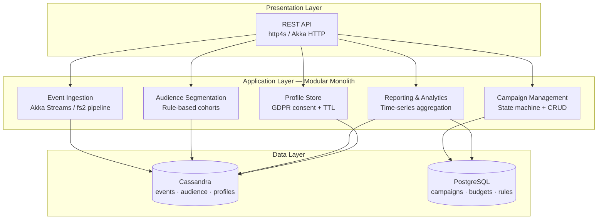
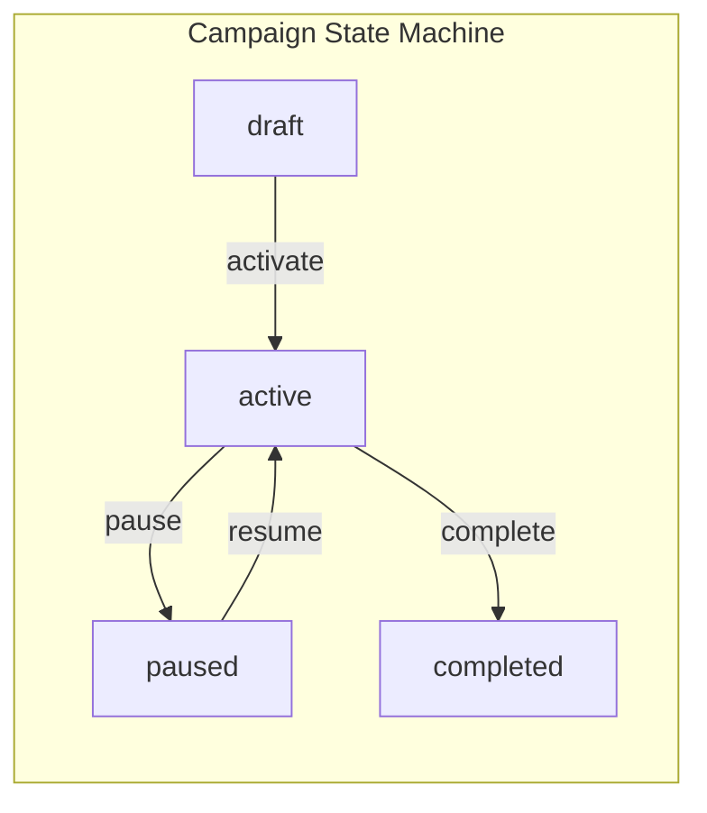
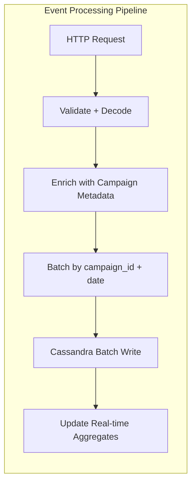

# Workshop: Campaign Performance Tracker

A marketing ROI platform that ingests clickstream events at scale, segments audiences, manages campaigns, and delivers real-time performance analytics — built as a 3-tier modular monolith in Scala.

**Challenge Repo:** https://github.com/TP-Coder-Innovation-Hub/campaign-performance-tracker-challenge

---

## Business Context

Marketing teams run campaigns across channels. They need to:

- Ingest high-volume clickstream events (clicks, impressions, conversions)
- Segment audiences by demographics and behavior
- Manage campaigns with budgets, targeting rules, and lifecycle states
- Report real-time performance metrics (CTR, conversion rate, ROI)

This platform addresses all four. The dual-database architecture separates write-heavy event ingestion (Cassandra) from transactional campaign metadata (PostgreSQL).

---

## Learning Objectives

By completing this capstone you will demonstrate:

1. **ADTs and sealed traits** for domain modeling (campaign states, consent status, event types)
2. **Cats Effect or ZIO** for effectful composition and resource safety
3. **Akka Streams or fs2** for streaming event processing pipelines
4. **Dual-database strategy** — Cassandra for write-heavy time-series, PostgreSQL for relational data
5. **Functional error handling** — typed errors via `EitherT`, `ZIO`, or `ApplicativeError`
6. **Type-safe HTTP routes** with http4s or Akka HTTP
7. **doobie** for compile-time-checked PostgreSQL queries
8. **Docker Compose** orchestration for multi-service local development

---

## Architecture

---

## Feature Requirements

### Module 1: Event Ingestion API

**High-throughput endpoint for clicks, impressions, and conversions.**

- `POST /api/v1/events` — accept batched clickstream events
- Request body must include: `event_type`, `campaign_id`, `user_id`, `timestamp`, `payload`
- Event types modeled as ADT: `Click | Impression | Conversion`
- Akka Streams or fs2 pipeline: validate → enrich → batch → write to Cassandra
- Cassandra partitioning by `campaign_id` + `date` for efficient time-range queries
- Batch writes to Cassandra (not one-at-a-time)
- Return `202 Accepted` with event IDs

**Acceptance Criteria:**

- [ ] `POST /api/v1/events` accepts a JSON array of events and returns `202` with IDs
- [ ] Invalid events return `400` with typed error details
- [ ] Events are persisted to Cassandra partitioned by `campaign_id` + `date`
- [ ] Pipeline uses Akka Streams or fs2 with backpressure
- [ ] Batch size is configurable via environment variable

---

### Module 2: Audience Segmentation

**Rule-based cohorts and behavioral segments.**

- `POST /api/v1/segments` — define a segment with rules (age range, location, behavior)
- `GET /api/v1/segments/{id}` — return segment definition and estimated size
- `GET /api/v1/segments/{id}/members` — list users in a segment (paginated)
- Rule engine evaluates: demographic filters (age, location) and behavioral filters (viewed > N times, abandoned cart)
- Segment rules modeled as sealed trait hierarchy
- Cassandra materialized views or manual secondary indexes for cross-partition queries

**Acceptance Criteria:**

- [ ] Segments are definable via JSON rules combining demographic and behavioral filters
- [ ] `GET /segments/{id}/members` returns paginated user list from Cassandra
- [ ] Behavioral rules query event history (e.g., "viewed product > 3 times in 7 days")
- [ ] Segment rules are modeled as an ADT with pattern-match evaluation

---

### Module 3: Campaign Management

**CRUD campaigns with lifecycle state machine.**

- `POST /api/v1/campaigns` — create campaign (draft state)
- `GET /api/v1/campaigns/{id}` — retrieve campaign details
- `PUT /api/v1/campaigns/{id}` — update campaign fields
- `PATCH /api/v1/campaigns/{id}/state` — transition state (draft → active → paused → completed)
- Campaign fields: name, budget, targeting rules, schedule (start/end), status
- State transitions enforced via sealed trait with compile-time exhaustiveness checking
- Invalid transitions return `409 Conflict`
- All data in PostgreSQL via doobie

**Acceptance Criteria:**

- [ ] Campaign CRUD operations persist to PostgreSQL via doobie
- [ ] Campaign state is a sealed trait with pattern-matched transitions
- [ ] Invalid state transitions (e.g., completed → active) return `409`
- [ ] Campaigns include budget, targeting rules, and schedule
- [ ] doobie queries are compile-time checked (using `doobie-hikari` + `doobie-h2` for tests)

---

### Module 4: Reporting & Analytics

**Real-time campaign performance and funnel metrics.**

- `GET /api/v1/campaigns/{id}/performance` — CTR, conversion rate, spend, ROI
- `GET /api/v1/campaigns/{id}/funnel` — funnel stages (impression → click → conversion)
- `GET /api/v1/campaigns/{id}/performance/timeseries?interval=hourly|daily` — time-bucketed metrics
- Aggregations computed from Cassandra time-series data
- Budget spend tracking against PostgreSQL campaign budget
- ROI calculation: `(revenue - spend) / spend`

**Acceptance Criteria:**

- [ ] Performance endpoint returns CTR, conversion rate, and ROI for a given campaign
- [ ] Funnel endpoint returns counts at each stage with drop-off percentages
- [ ] Time-series endpoint supports `hourly` and `daily` intervals via query parameter
- [ ] Aggregations query Cassandra using partition key (campaign_id + date)

---

### Module 5: Profile Store

**User profiles with GDPR consent and data retention.**

- `GET /api/v1/profiles/{user_id}` — user profile with event summary
- `GET /api/v1/profiles/{user_id}/consent` — current consent status
- `POST /api/v1/profiles/{user_id}/consent` — grant or revoke consent
- `DELETE /api/v1/profiles/{user_id}` — GDPR right-to-erasure (delete from Cassandra)
- Consent status modeled as ADT: `Granted | Denied | Withdrawn | Unknown`
- Cassandra TTL for automatic data expiration based on retention policy
- Profile data: user_id, demographics, consent history, last activity

**Acceptance Criteria:**

- [ ] Profile endpoint returns user data with event summary from Cassandra
- [ ] Consent status is an ADT; transitions are logged with timestamps
- [ ] `DELETE /profiles/{user_id}` removes all user data from Cassandra
- [ ] Cassandra tables use TTL for automatic data expiration
- [ ] Denied consent prevents event ingestion for that user (returns `403`)

---

## Tech Constraints

| Constraint | Requirement |
|---|---|
| Language | Scala 2.13 or 3.x |
| HTTP Framework | http4s or Akka HTTP |
| Effect System | Cats Effect 3 or ZIO 2 |
| Stream Processing | Akka Streams or fs2 |
| PostgreSQL Access | doobie (compile-time checked) |
| Cassandra Access | Phantom connector or DataStax Java driver wrapped in Cats Effect / ZIO |
| Domain Modeling | Sealed traits and ADTs for all enums and states |
| Error Handling | Typed errors (no exceptions in business logic) |
| Containerization | Docker Compose with Cassandra + PostgreSQL |
| Build Tool | sbt |

---

## Architecture Decision Records

### ADR-001: Modular Monolith over Microservices

**Context:** The system has five distinct bounded contexts with different data access patterns.

**Decision:** Build a modular monolith with clear package boundaries. Each module owns its data and exposes an internal Scala API. No shared mutable state between modules.

**Consequences:** Simpler deployment and local development. Module boundaries are enforced by package structure and internal APIs, not network calls. Can extract modules to separate services later if needed.

---

### ADR-002: Cassandra for Events, PostgreSQL for Campaigns

**Context:** Event ingestion is write-heavy with time-series access patterns. Campaign management is relational with transactional requirements.

**Decision:** Use Cassandra for events, audience data, and profiles (write-optimized, partitioned by campaign_id + date). Use PostgreSQL for campaign metadata, budgets, and targeting rules (relational integrity, ACID).

**Consequences:** Two databases to manage. Data consistency between them is eventual. Cassandra requires careful partition key design. PostgreSQL benefits from doobie's compile-time query checking.

---

### ADR-003: Sealed Traits for Domain Modeling

**Context:** Campaign states, event types, and consent status are finite, closed enumerations with behavior that varies by type.

**Decision:** Model all domain enums as sealed traits with case objects/case classes. Use pattern matching with exhaustiveness checking.

**Consequences:** Compiler enforces that all cases are handled. Refactoring is safe — adding a new case triggers compile errors everywhere it must be handled. No runtime surprise values.

---

### ADR-004: Akka Streams / fs2 for Event Pipeline

**Context:** Events arrive in bursts. Downstream writes to Cassandra must be batched and backpressured.

**Decision:** Use Akka Streams or fs2 to build the event processing pipeline. Backpressure propagates naturally from Cassandra write throughput back to the HTTP endpoint.

**Consequences:** Natural flow control without manual buffering. Higher cognitive complexity than a simple loop, but scales correctly. Must choose one (Akka Streams or fs2) and use it consistently.

---

### ADR-005: Typed Errors with Cats Effect / ZIO

**Context:** Business logic has distinct error types (validation errors, not-found, state conflicts, consent denied).

**Decision:** Use typed error channels — `IO[ErrorType, A]` with ZIO, or `EitherT[IO, ErrorType, A]` with Cats Effect. No exceptions for expected business failures.

**Consequences:** Error handling is explicit in type signatures. HTTP layer maps domain errors to status codes deterministically. Callers cannot ignore error cases.

---

## Submission Checklist

- [ ] All five modules implemented with passing acceptance criteria
- [ ] Docker Compose starts Cassandra + PostgreSQL + application with a single `docker-compose up`
- [ ] Database schemas applied via migration scripts (Flyway for PostgreSQL, Cassandra DDL scripts)
- [ ] Sealed traits used for: campaign states, event types, consent status, segment rules
- [ ] Event ingestion pipeline uses Akka Streams or fs2 with backpressure
- [ ] doobie queries are compile-time checked
- [ ] All errors are typed — no exceptions in business logic
- [ ] `/api/v1/events` endpoint handles batch writes to Cassandra
- [ ] Campaign state machine rejects invalid transitions with `409`
- [ ] GDPR delete endpoint removes user data from Cassandra
- [ ] Reporting endpoints compute CTR, conversion rate, ROI from Cassandra aggregations
- [ ] Unit tests for domain logic (state machines, segment rules, error types)
- [ ] Integration tests for at least one endpoint per module
- [ ] README with: setup instructions, architecture overview, module descriptions, how to run tests
- [ ] `.gitignore` excludes secrets, local configs, build artifacts
