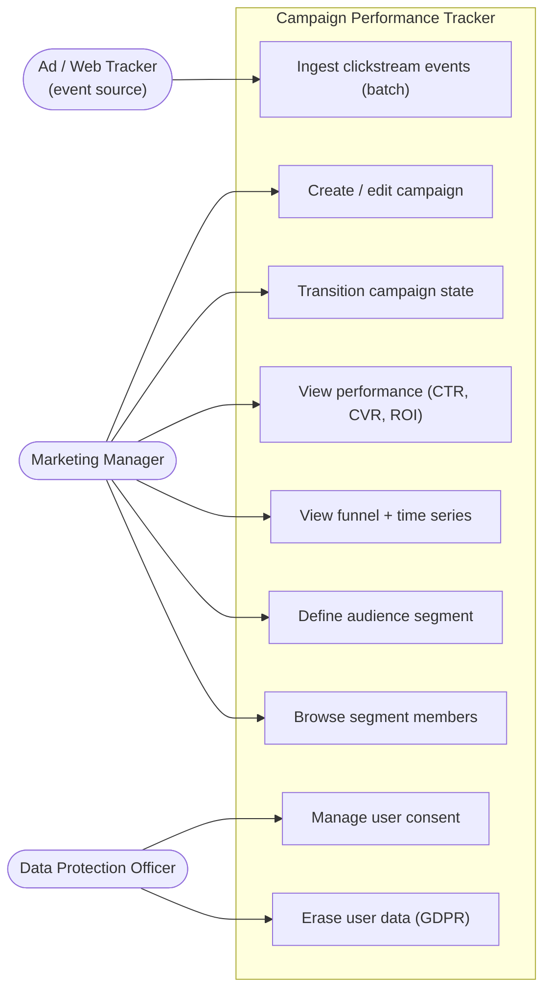
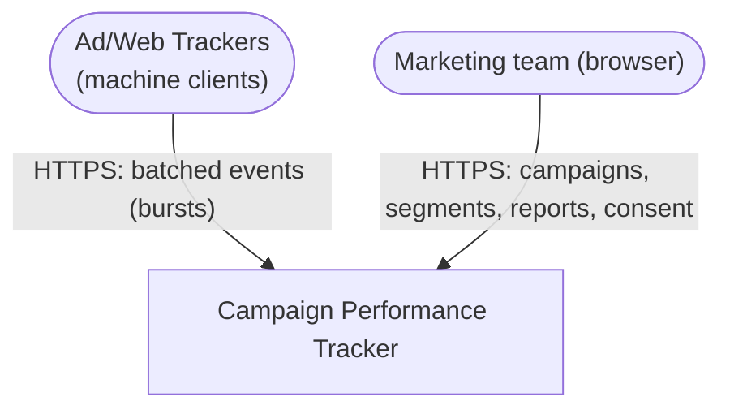
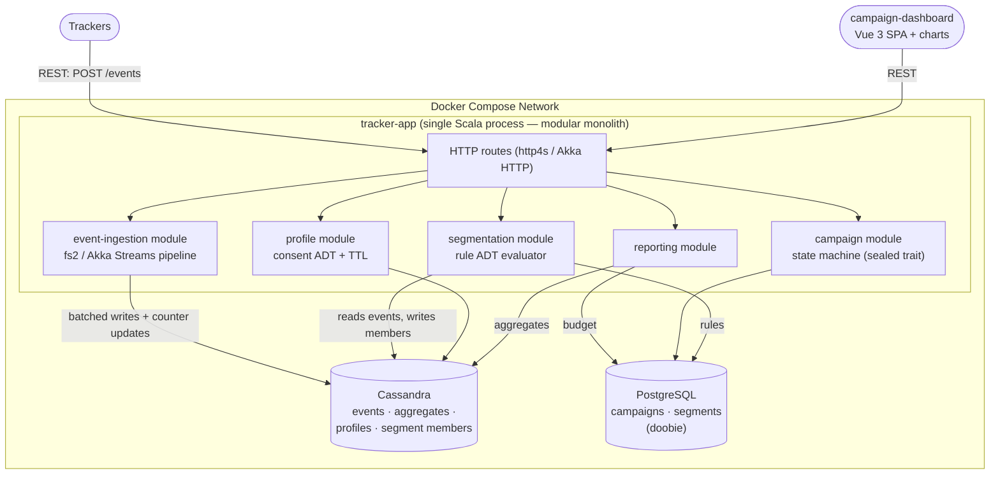
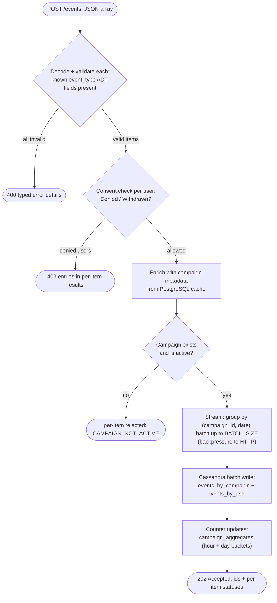
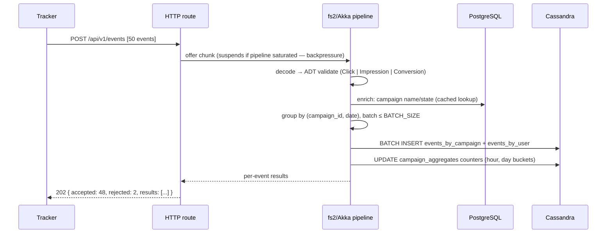
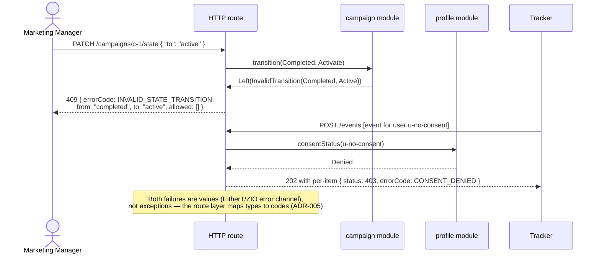

# Workshop Design: Campaign Performance Tracker

> Companion to [01-workshop-spec.md](./01-workshop-spec.md). Diagrams, contracts, schemas — module/package layout is yours (within ADR-001's modular-monolith boundaries).

## Design Notes (read first)

1. **Where money comes from.** ROI = `(revenue − spend) / spend`, but the spec never defines either input. This design: `Impression` and `Click` events carry a `cost` in their payload (ad-platform charge); `Conversion` events carry a `value` (order revenue). Spend = Σ cost, revenue = Σ value, both aggregated per campaign per time bucket. Cassandra counters are integers only — store money as **satang (×100)** `bigint` and convert at the edge.
2. **GDPR erasure is a two-step targeted delete, not a scan.** Events live in two tables: `events_by_campaign` (reporting) and `events_by_user` (behavior rules, profiles, erasure). Erasure reads the user's own event index first, then issues targeted deletes into the campaign partitions it learned about, then drops the user partition and profile. Aggregate counters are *not* decremented — counts are not personal data. Write this reasoning into your README; it's the most senior design thinking in the workshop.
3. **Segment membership is materialized, not computed per page.** Rule evaluation over event history is too expensive per `GET /members` request. Segments materialize into a Cassandra table at creation and via an added `POST /api/v1/segments/{id}/refresh`. `estimated_size` is recorded at materialization time. This is the standard pattern; evaluating live would teach a bad habit.
4. **No auth.** Internal marketing tool, single team; auth is not a learning objective and the spec omits it. Don't build it — document it as out of scope.

---

## Part 1: High-Level Design

### 1.1 Use-Case Diagram



### 1.2 System Context Diagram



### 1.3 Container Diagram



Module boundaries are package-level with internal Scala APIs (ADR-001) — the only network hops are HTTP in and the two databases out.

### 1.4 Activity Diagram — Event Ingestion Pipeline (primary business process)



### 1.5 Sequence Diagrams

#### 1.5.1 Happy path — batched ingestion with backpressure



#### 1.5.2 Error paths — typed errors to status codes



#### 1.5.3 GDPR erasure — targeted two-step delete

```mermaid
sequenceDiagram
    actor D as DPO
    participant API as HTTP route
    participant PS as profile module
    participant C as Cassandra

    D->>API: DELETE /api/v1/profiles/u-123
    API->>PS: erase(u-123)
    PS->>C: SELECT campaign_id, date, event_id FROM events_by_user WHERE user_id = u-123
    C-->>PS: index of the user's events (their partitions + keys)
    loop per (campaign_id, date) partition
        PS->>C: DELETE FROM events_by_campaign WHERE campaign_id=? AND date=? AND event_id IN (...)
    end
    PS->>C: DELETE FROM events_by_user WHERE user_id = u-123
    PS->>C: DELETE FROM profiles WHERE user_id = u-123
    PS->>C: DELETE FROM consent_history WHERE user_id = u-123
    PS-->>API: ErasureReport(eventsDeleted, partitionsTouched)
    API-->>D: 200 { eventsDeleted: 412, partitionsTouched: 9 }
    Note over PS,C: Aggregate counters stay — counts are not personal data.<br/>TTL would eventually expire the raw events anyway; erasure makes it immediate.
```

---

## Part 2: Frontend Design

### 2.1 Frontend Justification

One frontend: **Vue 3 campaign dashboard** for the Marketing Manager (and DPO functions on a separate route group). Trackers are machine clients. This is the chart-heavy frontend of the roadmap set — performance tiles, time-series, and funnel render from the reporting module, making the dual-database architecture *visible*: campaign metadata loads instantly (PostgreSQL), heavy aggregates stream in per chart (Cassandra). Use a chart library (ECharts or Chart.js — learner's choice).

### 2.2 Route Map (Vue 3)

| Route | Name | Purpose |
|---|---|---|
| `/` | CampaignList | Campaigns with state badges, budget vs spend bars; filter by state |
| `/campaigns/new` | CampaignCreate | Name, budget, schedule, targeting rules (creates in `draft`) |
| `/campaigns/:id` | CampaignDetail | KPI tiles (CTR, CVR, ROI, spend/budget) + state-transition buttons (only legal next states rendered) |
| `/campaigns/:id/analytics` | Analytics | Time-series chart (hourly/daily toggle) + funnel chart with drop-off % |
| `/segments` | SegmentList | Segments, estimated sizes, last-refreshed, refresh action |
| `/segments/new` | SegmentBuilder | Visual rule builder: demographic + behavioral conditions composed with AND/OR → renders the rule-ADT JSON |
| `/segments/:id` | SegmentDetail | Rules + paginated member list |
| `/privacy/profiles` | ProfileLookup | DPO: search by user_id |
| `/privacy/profiles/:userId` | ProfileDetail | Demographics, event summary, consent history; grant/revoke consent; **Erase** (typed-confirmation dialog → shows ErasureReport) |
| `/:pathMatch(.*)*` | NotFound | 404 |

Pinia stores: `campaigns`, `reporting` (per-campaign chart caches), `segments`.

### 2.3 Key UI Interactions

| Interaction | Behavior |
|---|---|
| State machine in the UI | Detail view renders only legal transitions for the current state (draft→activate; active→pause/complete; paused→resume); a 409 still handled gracefully (someone else transitioned first) — refetch and re-render |
| Charts | Time-series fetches on interval toggle (`hourly` for ≤ 48 h windows, `daily` beyond); funnel renders 3 stages with computed drop-off; charts poll every 30 s while campaign is `active` — "real-time" without sockets |
| Budget bar | spend/budget ratio with thresholds (>80% amber, >100% red) — spend from Cassandra, budget from PostgreSQL, the dual-DB join made visible |
| Segment builder | Composes the sealed-trait rule JSON (Part 3 shape) with client-side preview; server is authoritative — 422 on invalid rule shape maps to the offending condition row |
| Segment refresh | `POST /segments/:id/refresh` → optimistic "refreshing…" badge; poll detail until `last_refreshed` advances |
| GDPR erase | Confirmation requires typing the user_id; success screen shows the ErasureReport numbers (auditable UX) |

---

## Part 3: API Contracts

No auth (Design Note 4). Money fields: THB string decimal at the API edge (satang internally). Error envelope: `{ "status": 409, "errorCode": "INVALID_STATE_TRANSITION", "message": "...", "details": {} }`

### Events

| | |
|---|---|
| Endpoint | `POST /api/v1/events` |
| Request | `[ { "event_type": "click" \| "impression" \| "conversion", "campaign_id": uuid, "user_id": string, "timestamp": iso8601, "payload": { "cost"?: "0.85", "value"?: "1290.00", "product_id"?: string, "page"?: string } } ]` (max 500 per batch) |
| Response 202 | `{ "accepted": number, "rejected": number, "results": [ { "index": number, "event_id": uuid \| null, "status": 202 \| 400 \| 403 \| 422, "errorCode"?: "CONSENT_DENIED" \| "CAMPAIGN_NOT_ACTIVE" \| "MALFORMED_EVENT" } ] }` |
| Errors | `400` (body not an array / all malformed), `413` (batch > 500) |

### Campaigns

| | |
|---|---|
| `POST /api/v1/campaigns` — `{ "name": string, "budget": "50000.00", "targeting_rules": object, "schedule": { "start": date, "end": date } }` | 201 Campaign (state `draft`) · `422` |
| `GET /api/v1/campaigns?state=&page=0&size=20` | 200 paginated `Campaign` |
| `GET /api/v1/campaigns/{id}` | 200 `Campaign`: `{ "id", "name", "budget", "targeting_rules", "schedule", "state": "draft" \| "active" \| "paused" \| "completed", "created_at", "updated_at" }` · `404` |
| `PUT /api/v1/campaigns/{id}` | 200 Campaign · `409 CAMPAIGN_COMPLETED` (immutable once completed) · `404`, `422` |
| `PATCH /api/v1/campaigns/{id}/state` — `{ "to": "active" }` | 200 Campaign · `409 INVALID_STATE_TRANSITION` with `allowed: [string]` · `404` |

### Reporting

| | |
|---|---|
| `GET /api/v1/campaigns/{id}/performance` | 200 `{ "impressions": number, "clicks": number, "conversions": number, "ctr": 0.034, "conversion_rate": 0.012, "spend": "12450.00", "revenue": "48200.00", "roi": 2.87, "budget": "50000.00", "budget_used": 0.249 }` |
| `GET /api/v1/campaigns/{id}/funnel` | 200 `{ "stages": [ { "stage": "impression", "count": 120000 }, { "stage": "click", "count": 4080, "drop_off": 0.966 }, { "stage": "conversion", "count": 49, "drop_off": 0.988 } ] }` |
| `GET /api/v1/campaigns/{id}/performance/timeseries?interval=hourly\|daily&from=&to=` | 200 `{ "interval": "daily", "points": [ { "bucket": iso8601, "impressions", "clicks", "conversions", "spend", "revenue" } ] }` · `422 INVALID_INTERVAL` |

### Segments

| | |
|---|---|
| `POST /api/v1/segments` — `{ "name": string, "rules": RuleNode }` | 201 Segment (materialization starts) · `422 INVALID_RULE` |
| `GET /api/v1/segments/{id}` | 200 `{ "id", "name", "rules": RuleNode, "estimated_size": number, "last_refreshed": iso8601 \| null }` |
| `GET /api/v1/segments/{id}/members?page_state=&size=50` | 200 `{ "members": [ { "user_id", "age", "location", "last_activity" } ], "page_state": string \| null }` (Cassandra paging state, not offset) |
| `POST /api/v1/segments/{id}/refresh` | 202 (re-materialization queued) |

`RuleNode` (mirrors the sealed trait): `{ "op": "and" | "or", "children": [RuleNode] }` or leaf `{ "rule": "age_range", "min": 25, "max": 40 }` | `{ "rule": "location", "values": ["Bangkok","Chiang Mai"] }` | `{ "rule": "viewed_at_least", "times": 3, "days": 7 }` | `{ "rule": "abandoned_cart", "days": 14 }`

### Profiles & Consent

| | |
|---|---|
| `GET /api/v1/profiles/{user_id}` | 200 `{ "user_id", "age", "location", "consent_status": "granted" \| "denied" \| "withdrawn" \| "unknown", "last_activity": iso8601, "event_summary": { "impressions": n, "clicks": n, "conversions": n, "first_seen": iso8601 } }` · `404` |
| `GET /api/v1/profiles/{user_id}/consent` | 200 `{ "status": ConsentStatus, "history": [ { "status", "at": iso8601 } ] }` |
| `POST /api/v1/profiles/{user_id}/consent` — `{ "status": "granted" \| "denied" \| "withdrawn" }` | 200 updated consent (transition appended to history) · `422 UNKNOWN_STATUS` |
| `DELETE /api/v1/profiles/{user_id}` | 200 `{ "eventsDeleted": number, "partitionsTouched": number }` · `404` |

---

## Part 4: Database Schema

### PostgreSQL (campaign + segment metadata — doobie, Flyway)

```sql
CREATE TABLE campaigns (
    id              UUID PRIMARY KEY DEFAULT gen_random_uuid(),
    name            VARCHAR(128)  NOT NULL,
    budget_satang   BIGINT        NOT NULL CHECK (budget_satang > 0),  -- money as integer satang
    targeting_rules JSONB         NOT NULL DEFAULT '{}',
    schedule_start  DATE          NOT NULL,
    schedule_end    DATE          NOT NULL,
    state           VARCHAR(12)   NOT NULL DEFAULT 'draft'
                    CHECK (state IN ('draft','active','paused','completed')),
    created_at      TIMESTAMPTZ   NOT NULL DEFAULT now(),
    updated_at      TIMESTAMPTZ   NOT NULL DEFAULT now(),
    CHECK (schedule_end >= schedule_start)
);
CREATE INDEX idx_campaigns_state ON campaigns (state);

CREATE TABLE campaign_state_transitions (   -- audit of the state machine
    id          BIGSERIAL PRIMARY KEY,
    campaign_id UUID        NOT NULL REFERENCES campaigns(id),
    from_state  VARCHAR(12) NOT NULL,
    to_state    VARCHAR(12) NOT NULL,
    created_at  TIMESTAMPTZ NOT NULL DEFAULT now()
);

CREATE TABLE segments (
    id             UUID PRIMARY KEY DEFAULT gen_random_uuid(),
    name           VARCHAR(128) NOT NULL,
    rules          JSONB        NOT NULL,    -- serialized RuleNode ADT
    estimated_size INT          NOT NULL DEFAULT 0,
    last_refreshed TIMESTAMPTZ,
    created_at     TIMESTAMPTZ  NOT NULL DEFAULT now()
);
```

### Cassandra (events, aggregates, profiles — CQL scripts)

```sql
-- Reporting-side events. Partition = one campaign-day: time-range queries hit
-- exactly the partitions in range; no cross-partition scans for dashboards.
CREATE TABLE events_by_campaign (
    campaign_id uuid,
    date        date,
    event_time  timestamp,
    event_id    timeuuid,
    event_type  text,           -- 'click' | 'impression' | 'conversion' (ADT at the edge)
    user_id     text,
    cost_satang bigint,
    value_satang bigint,
    payload     text,           -- JSON
    PRIMARY KEY ((campaign_id, date), event_time, event_id)
) WITH CLUSTERING ORDER BY (event_time DESC)
  AND default_time_to_live = 7776000;       -- 90-day retention policy via TTL

-- User-side index of the same events: behavioral rules, profile summaries,
-- and the GDPR erasure index (Design Note 2).
CREATE TABLE events_by_user (
    user_id     text,
    event_time  timestamp,
    event_id    timeuuid,
    campaign_id uuid,
    date        date,           -- which campaign partition this event lives in
    event_type  text,
    payload     text,
    PRIMARY KEY ((user_id), event_time, event_id)
) WITH CLUSTERING ORDER BY (event_time DESC)
  AND default_time_to_live = 7776000;

-- Pre-aggregated counters per campaign per bucket. Counters must be integers:
-- money is satang. interval: 'hour' | 'day'; bucket: truncated timestamp.
CREATE TABLE campaign_aggregates (
    campaign_id   uuid,
    interval      text,
    bucket        timestamp,
    impressions   counter,
    clicks        counter,
    conversions   counter,
    spend_satang  counter,
    revenue_satang counter,
    PRIMARY KEY ((campaign_id, interval), bucket)
);

CREATE TABLE profiles (
    user_id        text PRIMARY KEY,
    age            int,
    location       text,
    consent_status text,        -- 'granted' | 'denied' | 'withdrawn' | 'unknown'
    last_activity  timestamp
) WITH default_time_to_live = 31536000;     -- 1-year inactivity expiry

CREATE TABLE consent_history (
    user_id    text,
    changed_at timestamp,
    status     text,
    PRIMARY KEY ((user_id), changed_at)
) WITH CLUSTERING ORDER BY (changed_at DESC);

CREATE TABLE segment_members (              -- materialized membership (Design Note 3)
    segment_id    uuid,
    user_id       text,
    age           int,
    location      text,
    last_activity timestamp,
    PRIMARY KEY ((segment_id), user_id)
);
```

Non-obvious decisions: the dual event tables are a deliberate Cassandra denormalization (query-first modeling — one table per access pattern); TTL on raw events implements the retention policy while erasure handles the immediate case; `segment_members` pages via Cassandra paging state, which is why the API exposes `page_state` instead of page numbers.

---

## Part 5: Event Contracts

No external broker — the contracts are the **ingestion event ADT** (the wire format trackers must produce) and the **pipeline stage contracts** inside the monolith.

### Ingestion event ADT (wire format)

```text
sealed trait ClickstreamEvent          // event_type discriminates
Click      { campaign_id, user_id, timestamp, payload: { cost, page } }
Impression { campaign_id, user_id, timestamp, payload: { cost, placement } }
Conversion { campaign_id, user_id, timestamp, payload: { value, product_id, order_id } }
```

Decoding is total: unknown `event_type` → `MalformedEvent` error value (never an exception), reported per-item in the 202 response.

### Pipeline stage contracts (fs2 `Pipe` / Akka `Flow` signatures)

| Stage | In → Out | Failure semantics |
|---|---|---|
| decode | `Json → Either[MalformedEvent, ClickstreamEvent]` | Left short-circuits to per-item 400 |
| consent gate | `ClickstreamEvent → Either[ConsentDenied, ClickstreamEvent]` | Left → per-item 403; profile consent read-through cache |
| enrich | `ClickstreamEvent → Either[CampaignNotActive, EnrichedEvent]` | campaign metadata cached from PostgreSQL (refresh ≤ 30 s) |
| batch | `EnrichedEvent → Chunk[EnrichedEvent]` grouped by `(campaign_id, date)`, max `BATCH_SIZE` (env) | backpressure propagates to HTTP (ADR-004) |
| write | `Chunk → Cassandra BATCH` (same partition) + counter updates | retry ×3 with backoff; then fail the request items — never drop silently |

Counter updates are idempotence-*unsafe* (counters can't dedup) — a write retried after a partial failure can double-count. State this limitation in your README and why it's acceptable for marketing analytics (counts are estimates, raw events are the audit source).

---

## Part 6: Seed Data

```sql
-- PostgreSQL ----------------------------------------------------------------
INSERT INTO campaigns (id, name, budget_satang, targeting_rules, schedule_start, schedule_end, state) VALUES
('ca000001-0000-0000-0000-000000000001', 'Songkran Mega Sale',   500000000, '{"channels":["facebook","line"]}',
 CURRENT_DATE - 14, CURRENT_DATE + 14, 'active'),
('ca000001-0000-0000-0000-000000000002', 'New Year Teaser',      100000000, '{}',
 CURRENT_DATE + 30, CURRENT_DATE + 60, 'draft'),
('ca000001-0000-0000-0000-000000000003', 'Mother''s Day 2025',    80000000, '{}',
 CURRENT_DATE - 90, CURRENT_DATE - 60, 'completed');  -- 80,000,000 satang = 800,000.00 THB

INSERT INTO campaign_state_transitions (campaign_id, from_state, to_state, created_at) VALUES
('ca000001-0000-0000-0000-000000000001', 'draft', 'active', now() - interval '14 days'),
('ca000001-0000-0000-0000-000000000003', 'active', 'completed', now() - interval '60 days');

INSERT INTO segments (id, name, rules, estimated_size, last_refreshed) VALUES
('se000001-0000-0000-0000-000000000001', 'Bangkok engaged 25-40',
 '{"op":"and","children":[{"rule":"age_range","min":25,"max":40},{"rule":"location","values":["Bangkok"]},{"rule":"viewed_at_least","times":3,"days":7}]}',
 2, now() - interval '1 hour'),
('se000001-0000-0000-0000-000000000002', 'Cart abandoners',
 '{"rule":"abandoned_cart","days":14}', 1, now() - interval '1 day');
```

```sql
-- Cassandra (CQL) -------------------------------------------------------------
INSERT INTO profiles (user_id, age, location, consent_status, last_activity) VALUES
('u-somchai', 34, 'Bangkok',    'granted',  toTimestamp(now()));
INSERT INTO profiles (user_id, age, location, consent_status, last_activity) VALUES
('u-malee',   28, 'Bangkok',    'granted',  toTimestamp(now()));
INSERT INTO profiles (user_id, age, location, consent_status, last_activity) VALUES
('u-prasert', 52, 'Khon Kaen',  'denied',   toTimestamp(now()));   -- ingestion must 403 per-item
INSERT INTO profiles (user_id, age, location, consent_status, last_activity) VALUES
('u-nok',     23, 'Chiang Mai', 'withdrawn', toTimestamp(now()));  -- was granted, then withdrew

INSERT INTO consent_history (user_id, changed_at, status) VALUES ('u-nok', '2026-01-10 09:00:00+0000', 'granted');
INSERT INTO consent_history (user_id, changed_at, status) VALUES ('u-nok', '2026-05-01 14:30:00+0000', 'withdrawn');

INSERT INTO segment_members (segment_id, user_id, age, location, last_activity) VALUES
(b0000001-0000-0000-0000-000000000001, 'u-somchai', 34, 'Bangkok', toTimestamp(now()));
INSERT INTO segment_members (segment_id, user_id, age, location, last_activity) VALUES
(b0000001-0000-0000-0000-000000000001, 'u-malee',   28, 'Bangkok', toTimestamp(now()));

UPDATE campaign_aggregates SET impressions = impressions + 18000, clicks = clicks + 540,
  conversions = conversions + 6, spend_satang = spend_satang + 1530000,
  revenue_satang = revenue_satang + 774000
WHERE campaign_id = a0000001-0000-0000-0000-000000000001 AND interval = 'day'
  AND bucket = '2026-06-11 00:00:00+0000';
UPDATE campaign_aggregates SET impressions = impressions + 17200, clicks = clicks + 516,
  conversions = conversions + 5, spend_satang = spend_satang + 1462000,
  revenue_satang = revenue_satang + 645000
WHERE campaign_id = a0000001-0000-0000-0000-000000000001 AND interval = 'day'
  AND bucket = '2026-06-10 00:00:00+0000';
UPDATE campaign_aggregates SET impressions = impressions + 16500, clicks = clicks + 495,
  conversions = conversions + 7, spend_satang = spend_satang + 1410000,
  revenue_satang = revenue_satang + 903000
WHERE campaign_id = a0000001-0000-0000-0000-000000000001 AND interval = 'day'
  AND bucket = '2026-06-09 00:00:00+0000';
UPDATE campaign_aggregates SET impressions = impressions + 19100, clicks = clicks + 573,
  conversions = conversions + 4, spend_satang = spend_satang + 1620000,
  revenue_satang = revenue_satang + 516000
WHERE campaign_id = a0000001-0000-0000-0000-000000000001 AND interval = 'day'
  AND bucket = '2026-06-08 00:00:00+0000';
UPDATE campaign_aggregates SET impressions = impressions + 15800, clicks = clicks + 474,
  conversions = conversions + 8, spend_satang = spend_satang + 1340000,
  revenue_satang = revenue_satang + 1032000
WHERE campaign_id = a0000001-0000-0000-0000-000000000001 AND interval = 'day'
  AND bucket = '2026-06-07 00:00:00+0000';
UPDATE campaign_aggregates SET impressions = impressions + 14700, clicks = clicks + 441,
  conversions = conversions + 3, spend_satang = spend_satang + 1250000,
  revenue_satang = revenue_satang + 387000
WHERE campaign_id = a0000001-0000-0000-0000-000000000001 AND interval = 'day'
  AND bucket = '2026-06-06 00:00:00+0000';
UPDATE campaign_aggregates SET impressions = impressions + 13400, clicks = clicks + 402,
  conversions = conversions + 5, spend_satang = spend_satang + 1140000,
  revenue_satang = revenue_satang + 645000
WHERE campaign_id = a0000001-0000-0000-0000-000000000001 AND interval = 'day'
  AND bucket = '2026-06-05 00:00:00+0000';

-- Sample events: u-somchai (5 events) and u-malee (5 events) over 7 days
-- Both exceed the "viewed > 3 times in 7 days" behavioral rule
INSERT INTO events_by_campaign (campaign_id, event_date, event_id, user_id, event_type, created_at) VALUES
(a0000001-0000-0000-0000-000000000001, '2026-06-05', e0000001-0000-0000-0000-000000000001, 'u-somchai', 'impression', '2026-06-05 09:12:00+0000');
INSERT INTO events_by_campaign (campaign_id, event_date, event_id, user_id, event_type, created_at) VALUES
(a0000001-0000-0000-0000-000000000001, '2026-06-06', e0000002-0000-0000-0000-000000000002, 'u-somchai', 'click',      '2026-06-06 14:30:00+0000');
INSERT INTO events_by_campaign (campaign_id, event_date, event_id, user_id, event_type, created_at) VALUES
(a0000001-0000-0000-0000-000000000001, '2026-06-08', e0000003-0000-0000-0000-000000000003, 'u-somchai', 'impression', '2026-06-08 11:05:00+0000');
INSERT INTO events_by_campaign (campaign_id, event_date, event_id, user_id, event_type, created_at) VALUES
(a0000001-0000-0000-0000-000000000001, '2026-06-10', e0000004-0000-0000-0000-000000000004, 'u-somchai', 'click',      '2026-06-10 16:45:00+0000');
INSERT INTO events_by_campaign (campaign_id, event_date, event_id, user_id, event_type, created_at) VALUES
(a0000001-0000-0000-0000-000000000001, '2026-06-11', e0000005-0000-0000-0000-000000000005, 'u-somchai', 'conversion', '2026-06-11 10:20:00+0000');
INSERT INTO events_by_campaign (campaign_id, event_date, event_id, user_id, event_type, created_at) VALUES
(a0000001-0000-0000-0000-000000000001, '2026-06-05', e0000006-0000-0000-0000-000000000006, 'u-malee',   'impression', '2026-06-05 18:40:00+0000');
INSERT INTO events_by_campaign (campaign_id, event_date, event_id, user_id, event_type, created_at) VALUES
(a0000001-0000-0000-0000-000000000001, '2026-06-07', e0000007-0000-0000-0000-000000000007, 'u-malee',   'impression', '2026-06-07 08:15:00+0000');
INSERT INTO events_by_campaign (campaign_id, event_date, event_id, user_id, event_type, created_at) VALUES
(a0000001-0000-0000-0000-000000000001, '2026-06-09', e0000008-0000-0000-0000-000000000008, 'u-malee',   'click',      '2026-06-09 12:50:00+0000');
INSERT INTO events_by_campaign (campaign_id, event_date, event_id, user_id, event_type, created_at) VALUES
(a0000001-0000-0000-0000-000000000001, '2026-06-10', e0000009-0000-0000-0000-000000000009, 'u-malee',   'impression', '2026-06-10 20:30:00+0000');
INSERT INTO events_by_campaign (campaign_id, event_date, event_id, user_id, event_type, created_at) VALUES
(a0000001-0000-0000-0000-000000000001, '2026-06-11', e0000010-0000-0000-0000-00000000000a, 'u-malee',   'click',      '2026-06-11 09:10:00+0000');

INSERT INTO events_by_user (user_id, event_date, event_id, campaign_id, event_type, created_at) VALUES
('u-somchai', '2026-06-05', e0000001-0000-0000-0000-000000000001, a0000001-0000-0000-0000-000000000001, 'impression', '2026-06-05 09:12:00+0000');
INSERT INTO events_by_user (user_id, event_date, event_id, campaign_id, event_type, created_at) VALUES
('u-somchai', '2026-06-06', e0000002-0000-0000-0000-000000000002, a0000001-0000-0000-0000-000000000001, 'click',      '2026-06-06 14:30:00+0000');
INSERT INTO events_by_user (user_id, event_date, event_id, campaign_id, event_type, created_at) VALUES
('u-somchai', '2026-06-08', e0000003-0000-0000-0000-000000000003, a0000001-0000-0000-0000-000000000001, 'impression', '2026-06-08 11:05:00+0000');
INSERT INTO events_by_user (user_id, event_date, event_id, campaign_id, event_type, created_at) VALUES
('u-somchai', '2026-06-10', e0000004-0000-0000-0000-000000000004, a0000001-0000-0000-0000-000000000001, 'click',      '2026-06-10 16:45:00+0000');
INSERT INTO events_by_user (user_id, event_date, event_id, campaign_id, event_type, created_at) VALUES
('u-somchai', '2026-06-11', e0000005-0000-0000-0000-000000000005, a0000001-0000-0000-0000-000000000001, 'conversion', '2026-06-11 10:20:00+0000');
INSERT INTO events_by_user (user_id, event_date, event_id, campaign_id, event_type, created_at) VALUES
('u-malee',   '2026-06-05', e0000006-0000-0000-0000-000000000006, a0000001-0000-0000-0000-000000000001, 'impression', '2026-06-05 18:40:00+0000');
INSERT INTO events_by_user (user_id, event_date, event_id, campaign_id, event_type, created_at) VALUES
('u-malee',   '2026-06-07', e0000007-0000-0000-0000-000000000007, a0000001-0000-0000-0000-000000000001, 'impression', '2026-06-07 08:15:00+0000');
INSERT INTO events_by_user (user_id, event_date, event_id, campaign_id, event_type, created_at) VALUES
('u-malee',   '2026-06-09', e0000008-0000-0000-0000-000000000008, a0000001-0000-0000-0000-000000000001, 'click',      '2026-06-09 12:50:00+0000');
INSERT INTO events_by_user (user_id, event_date, event_id, campaign_id, event_type, created_at) VALUES
('u-malee',   '2026-06-10', e0000009-0000-0000-0000-000000000009, a0000001-0000-0000-0000-000000000001, 'impression', '2026-06-10 20:30:00+0000');
INSERT INTO events_by_user (user_id, event_date, event_id, campaign_id, event_type, created_at) VALUES
('u-malee',   '2026-06-11', e0000010-0000-0000-0000-00000000000a, a0000001-0000-0000-0000-000000000001, 'click',      '2026-06-11 09:10:00+0000');
```

| Seeded scenario | What it exercises |
|---|---|
| Campaign in each of 3 states (+1 via transition) | State badges, legal-transition buttons, 409 on completed→active |
| `u-prasert` consent `denied` | Per-item 403 in batch ingestion |
| `u-nok` granted→withdrawn history | Consent ADT transitions + history endpoint |
| 7 daily + 24 hourly aggregate buckets | Time-series both intervals, KPI tiles, ROI math (incl. negative-ROI day if you seed one) |
| Materialized segment with 2 members | Members paging, estimated size, refresh |
| 10 sample events (u-somchai: 5, u-malee: 5) | Behavioral rule "viewed > 3 times" matches both; GDPR erasure produces non-trivial report for u-somchai |
